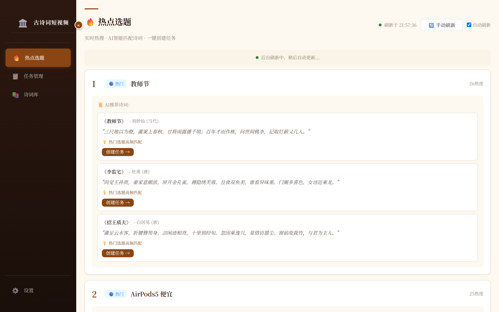
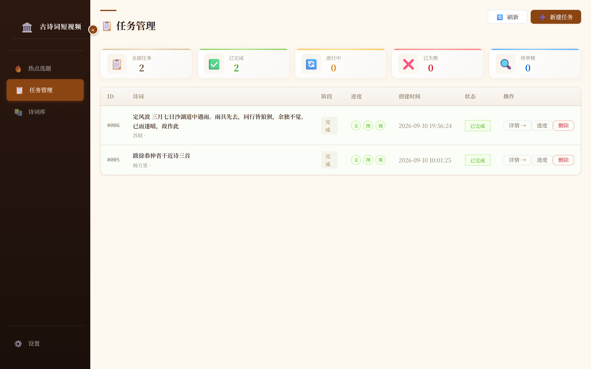
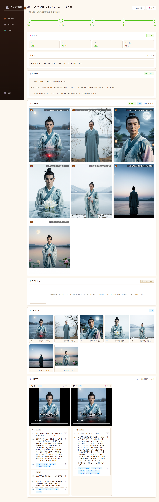
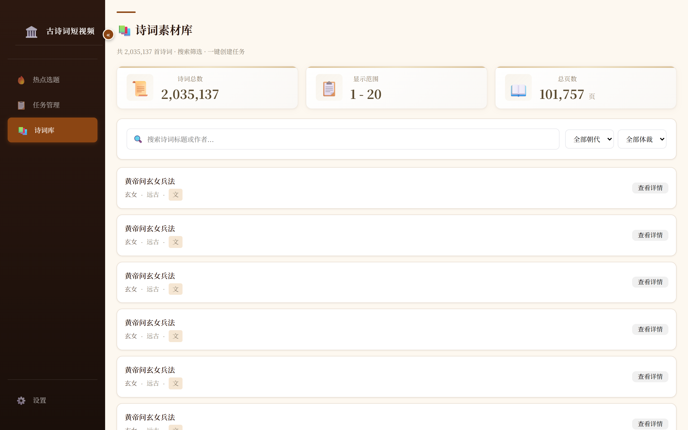
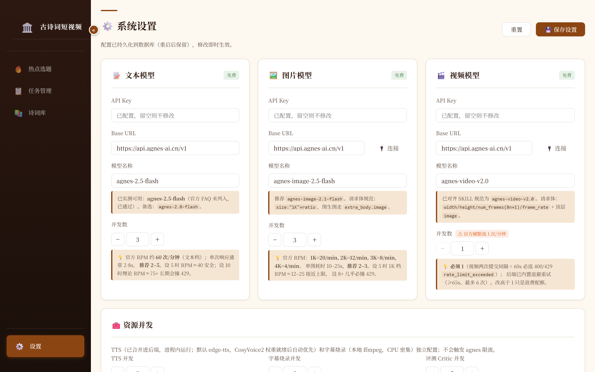

# 古诗词短视频工厂

基于**兼容 OpenAI 的 LLM API**（文本 / 图像 / 视频生成，OpenAI 兼容接口）的古诗词短视频**自动化生产系统**：从 200 万+ 首古诗词中智能选题、AI 生成文案与分镜、AI 出图出视频、多平台适配与发布，全流程可视化监控。

> 一条流水线把一首古诗词变成可直接发布到**抖音 / 快手 / 小红书 / B站 / YouTube** 的短视频（抖快红 9:16·3:4 竖屏 + B站/YouTube 16:9 横屏，一次生成多平台适配尺寸）。

## 功能特性

- 🎯 **智能选题**：从 200 万+ 首古诗词中筛选，支持"热搜热点 → AI 匹配诗词 → 一键建任务"
- 📝 **AI 文案**：Generator-Critic 双角色，自动生成 + 打分 + 低分自动重写
- 🎨 **AI 分镜与图片**：按文案拆分镜、生成角色定妆照锁定人物一致性、批量出图并评分
- 🎬 **AI 视频**：图生视频，多平台画幅适配（抖音/快手 9:16、小红书 3:4、B 站 16:9）
- 🔤 **配音与字幕**：edge-tts / CosyVoice 双引擎 TTS，字幕 SRT 烧录，音画转场对齐
- 📤 **多平台发布文案**：LLM 按各平台字数/话题规范生成吸睛标题、描述、话题标签，一键复制
- 🖥️ **Web 管理台**：热点、任务、详情、诗词库、系统设置五大页面，WebSocket 实时进度

## 项目截图

> 截图见 [`docs/images/`](docs/images/)，本地 `npm run dev` 启动后访问 `http://localhost:5173` 即可复现。

**① 热点选题** —— 抓取热搜，AI 匹配相关诗词，一键创建生成任务：



**② 任务管理** —— 全部任务的状态统计与列表，支持查看详情 / 进度 / 删除：



**③ 任务详情** —— 流水线五阶段进度、AI 文案、分镜画面、角色定妆照、AI 图片画廊、多平台成片预览（含 LLM 发布文案 + 下载）、人工审核区：



**④ 诗词库** —— 200 万+ 首古诗词，按标题/作者/朝代/体裁检索，一键建任务：



**⑤ 系统设置** —— 文本/图片/视频三套模型配置（API Key、Base URL、并发数）与资源并发，持久化到数据库、热更新即时生效：



## 技术栈

### 后端 (server/)
- **Python 3.12（uv 托管）**
- **uv** - 依赖管理与虚拟环境
- **FastAPI** - Web 框架
- **SQLAlchemy** - ORM
- **OpenCC** - 繁简转换
- **httpx** - HTTP 客户端
- **ffmpeg** - 视频合成 / 配音 / 字幕烧录

### 前端 (client/)
- **Vue 3** - UI 框架
- **Arco Design** - 组件库
- **Vite** - 构建工具
- **Pinia** - 状态管理
- **WebSocket** - 实时进度推送

### AI 服务（兼容 OpenAI 的 LLM API）
- **文本模型** - 文案 / 分镜 / 评分 / 发布文案（走 OpenAI 兼容 `chat/completions` 接口）
- **图像模型** - 定妆照 / 分镜图（OpenAI 兼容 `images/generations` 接口）
- **视频模型** - 图生视频（OpenAI 兼容视频生成接口）

> 模型名 / Base URL / API Key 均在系统设置页可配置，或写入 `.env`；项目不绑定任何特定厂商，任何兼容 OpenAI 协议的服务均可接入。

## 如何使用

### 1. 环境要求

- **uv**（含 Python 3.12 托管，后端无需全局 Python）
- **Node.js 18+**
- **ffmpeg**（视频合成/字幕烧录依赖，需 `ffmpeg` / `ffprobe` 在 PATH）
- **LLM API Key**（兼容 OpenAI 的接口，任意厂商均可）

### 2. 安装依赖

后端 Python 依赖统一由 uv 管理（基于 `server/pyproject.toml` + `server/uv.lock`）：

```bash
# 后端（核心依赖）
cd server
uv sync

# 如需启用 CosyVoice 高质量 TTS（可选）
uv sync --extra cosyvoice

# 前端
cd client
npm install
```

### 3. 配置

复制环境变量模板为 `.env`，填入你的 LLM API Key（兼容 OpenAI 的接口）：

```bash
cp server/.env.example server/.env      # 后端（API Key、APP_TOKEN 等）
cp client/.env.example client/.env      # 前端（VITE_APP_TOKEN，与后端 APP_TOKEN 保持一致）
```

### 4. 启动

```bash
# 方式一：Windows 一键脚本
start.bat

# 方式二：手动启动
# 后端（uv 托管，使用 server/.venv）
cd server
uv run uvicorn app.main:app --reload        # http://127.0.0.1:8000

# 前端
cd client
npm run dev                                  # http://localhost:5173
```

停止：`stop.bat` 或 Ctrl+C。

> **数据库**：后端用 SQLite（`server/data/poems.db`，9 张表），首次启动自动建表。数据库文件不入库；完整建表语句（DDL）见 [`docs/schema.sql`](docs/schema.sql)，需要手动初始化时可直接 `sqlite3 server/data/poems.db < docs/schema.sql`。

### 5. 导入古诗词数据

数据源（CNKGraph 古诗词语料，约 200 万+ 首）：

- **下载**：<https://c.cnkgraph.com/data/cnkgraph.writings.zip>

解压后将 `CNKGraph.Writings.xml` 导入：

```bash
cd server
python scripts/import_xml.py --file "path/to/CNKGraph.Writings.xml"
```

导入后诗词库即可检索与建任务（约 200 万+ 首）。

### 6. 使用流程

1. **选素材**：在「热点选题」看热搜 → AI 推荐相关诗词，或在「诗词库」直接检索
2. **建任务**：选中目标平台（可多选）→ 一键创建，流水线自动跑 文案 → 定妆照 → 分镜图 → 配音 → 视频 → 字幕
3. **看进度**：任务详情页 WebSocket 实时推送五阶段进度，可逐阶段重生成
4. **人工审核**：流水线完成后进入「待审核」，确认产物 → 通过
5. **发布**：每个视频卡片下方已按平台生成吸睛标题/描述/话题（LLM），一键复制 → 粘贴到各 App 发布；或导出成片视频

## 项目结构

```
├── server/                 # 后端（FastAPI）
│   ├── app/
│   │   ├── api/           # API 路由
│   │   ├── models/        # 数据模型
│   │   ├── services/      # 业务逻辑（流水线/文案/图片/视频/TTS/发布）
│   │   └── utils/         # 工具函数
│   ├── scripts/           # 数据导入 / ETL / 生成脚本
│   ├── pyproject.toml     # uv 依赖声明（核心 + cosyvoice extra）
│   └── uv.lock            # uv 锁定文件（唯一事实源）
├── client/                 # 前端（Vue 3）
│   ├── src/
│   │   ├── views/         # 页面（热点/任务/详情/诗词/设置）
│   │   ├── api/           # API 客户端
│   │   └── styles/        # 样式
│   └── package.json
├── docs/                   # 文档与截图
│   ├── images/            # README 用截图
│   └── design/            # 设计文档
├── start.bat / stop.bat    # Windows 一键启停
└── README.md
```

## API 接口

- `GET /api/poems` / `GET /api/poems/stats` - 诗词列表 / 统计
- `GET /api/tasks` - 任务列表
- `POST /api/tasks` - 创建任务
- `POST /api/tasks/{id}/start` - 启动任务
- `POST /api/tasks/{id}/regenerate?stage=...` - 重跑指定阶段
- `POST /api/tasks/{id}/publish-content` - 按需生成各平台发布文案（LLM）
- `POST /api/tasks/{id}/publish` - 发布到各平台
- `WS /ws/progress/{task_id}` - 实时进度

## 开发说明

### Generator-Critic 架构

系统使用同一个 LLM 模型（兼容 OpenAI 的文本模型）扮演两个角色：

1. **生成者**：负责生成文案、分镜提示词
2. **评判者**：负责评分、给出改进建议

这种设计确保了审美标准的一致性，同时降低了成本。

### 并发控制

- 文案生成：5 并发
- 图片生成：5 并发
- 视频生成：1 并发（API 限速）
- 评分：5 并发

### 质检流程

1. 生成内容
2. 模型评分（0-10 分）
3. 低于阈值（默认 7 分）自动重写
4. 最多重试 3 次

## License

本项目基于 **MIT 许可证**（见 [`LICENSE`](LICENSE)），并附加使用限制条款：

- **仅供学习与研究**：代码、文档、数据脚本与产物模板面向学习 / 研究 / 个人练习免费开放。
- **商用需授权**：任何商业使用（商用产品、SaaS、付费内容批量生产、企业生产经营等）**须事先联系版权持有人获得书面授权**（见 GitHub <https://github.com/liuchangng/verse-reel>）。

完整条款以 [`LICENSE`](LICENSE) 为准。
